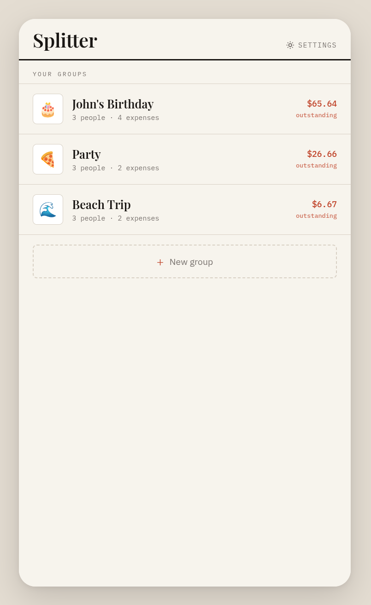
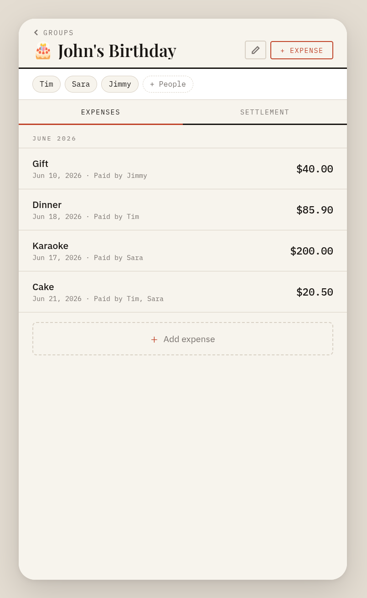
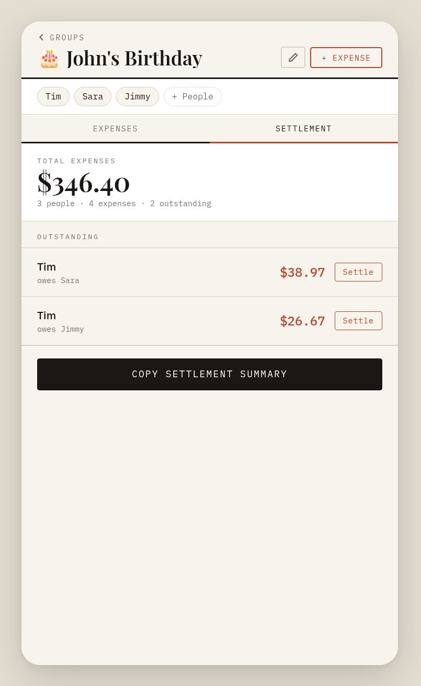

# Splitter — Split bills fast, easy and locally

A zero-friction bill-splitting web app for friend groups. No accounts, no installs, no internet required after the first load.

---

## Description

Splitter is a single-file web app for splitting shared expenses. Open it, create a group, add people and bills, and it tells you exactly who owes whom — with the minimum number of transactions. Built for the table, the trip, and everything in between. All data lives in your browser's local storage; nothing ever leaves your device.

---

## Features

- **Groups** — create multiple named groups (Mexico Trip, Monthly Dinners, Ski Weekend), each with its own people and expense history
- **Expense wizard** — a focused 4-step flow: name and amount → who paid → how to split → review before saving
- **Flexible payments** — one person paid, or multiple people split the bill; custom amounts per payer
- **Custom splits** — assign exact amounts per person, or use "Split equally" (rounding handled automatically) or "Match payments"
- **Debt minimisation** — the settlement view computes the fewest possible transactions to settle all debts across all expenses
- **Settle and unsettle** — mark individual debts as settled without deleting the underlying expenses; reverse it if you made a mistake
- **Share summary** — one tap copies a plain-text settlement breakdown ready to paste into any chat app
- **Offline-first** — no network dependency; works with bad wifi at the restaurant
- **Responsive** — phone-frame layout on desktop, full-bleed on mobile
- **Zero dependencies** — a single `.html` file; no build step, no package manager, no framework

---

## Demo / Screenshots





---

## Usage

### Use the web app

- Visit http://splitter.jhutty.de
- enjoy!

### Deploy yourself

Because Splitter is a single HTML file, deployment is just file hosting.

**Any static host / your own server**
```bash
# nginx / Apache — just drop it in the webroot
cp index.html /var/www/html/index.html

# Python quick preview (local only)
python3 -m http.server 8080
# then open http://localhost:8080/index.html
```

### Local development

No build step required. Open the file directly in a browser:

```bash
open index.html          # macOS
xdg-open index.html      # Linux
start index.html         # Windows
```

Or serve it locally to avoid any browser file-protocol quirks:

```bash
npx serve .
# or
python3 -m http.server 8080
```

### Data storage

All data is written to `localStorage` under two keys:

| Key | Contents |
|-----|----------|
| `splitapp_v1` | Groups, people, expenses, and settlements |
| `splitapp_settings_v1` | User preferences (your name) |

---

## Contributing

Contributions are welcome. Please follow the guidelines below to keep the codebase consistent.

### Branching

Use short, descriptive branch names prefixed by type:

Open all pull requests against `main`. Keep PRs focused with one concern per PR.

### Code style

The entire app lives in `index.html`. The structure is:

```
index.html
├── <style>   — CSS custom properties, component styles
├── <body>    — static HTML shells for each screen
└── <script>  — all application logic (vanilla JS, no framework)
```

A few conventions to preserve:

- **Money is always integers (cents).** Use `toCents()` to parse user input and `fmtMoney()` to display. Never store or compute with floats.
- **No innerHTML with unsanitised user data.** Run all user-supplied strings through `esc()` before inserting into HTML.
- **Namespace related functions in objects** (`Wizard`, `Settlement`, `Group`, etc.) rather than adding top-level functions.
- **CSS custom properties for all colours and type.** Don't hardcode hex values outside `:root`.
- Use `const` and `let`; no `var`. Arrow functions for callbacks, named functions for anything called by name elsewhere.


### Submitting a PR

1. Fork the repo and create your branch from `main`
2. Make your changes, test manually per the checklist above
3. Open a pull request with a clear description of what changed and why
4. Link any related issues in the PR body

---

## License

Apache License 2.0 — see [`LICENSE`](LICENSE) for details.
